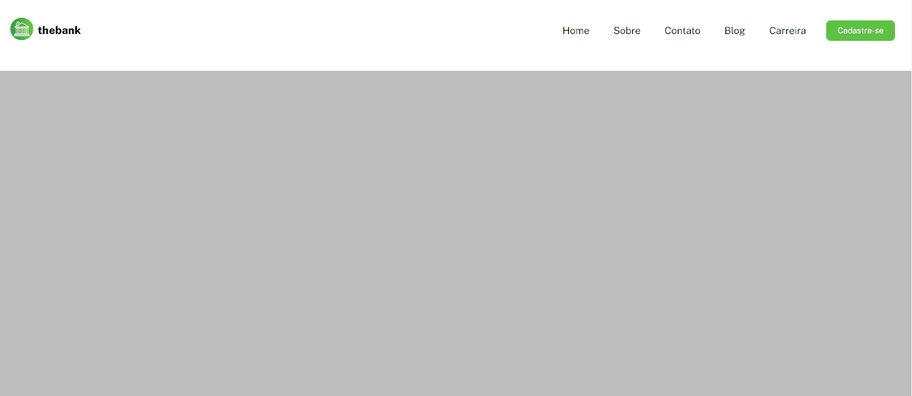

# Mobile First Menu Responsivo

Este projeto é parte de um exercício proposto no curso DevQuest, destinado a praticar habilidades em CSS Flexbox e a criação de menus responsivos. O objetivo principal é aplicar a abordagem mobile first em um layout pronto (para desktop e mobile) disponibilizado no Figma. Com essa técnica, o desenvolvimento é inicialmente direcionado para telas menores, garantindo uma experiência de usuário otimizada, e posteriormente ajustado para desktops utilizando media queries.


## Preview



## Tecnologias Utilizadas

- HTML
- CSS (Flexbox, Mobile First)

## Estrutura de Pastas

```
📦 menu-responsivo-mobile-first
 ┣ 📂 src
 ┃ ┣ 📂 css
 ┃ ┃ ┣ 📜 reset.css
 ┃ ┃ ┣ 📜 responsive.css
 ┃ ┃ ┗ 📜 style.css
 ┃ ┗ 📂 img
 ┃   ┣ 🖼️ logo.png
 ┃   ┣ 🖼️ favicon.ico
 ┃   ┗ 🖼️ preview.png
 ┣ 📜 index.html
 ┣ 🖼️ menu-responsivo-mobile-first.gif
 ┗ 📜 README.md
```

## Como Usar

1. Clone este repositório:

```bash
git clone https://github.com/Alberesbass/menu-responsivo-mobile-first.git
```

2. Navegue até o diretório do projeto:

```bash
cd menu-responsivo-mobile-first
```

3. Abra o arquivo `index.html` no seu navegador da web.

## Licença

Este projeto está sob a licença MIT. Consulte o arquivo [LICENSE](./LICENSE) para obter mais informações.

---

Desenvolvido por [Alberes](https://github.com/Alberesbass)
